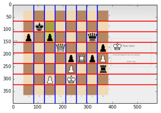
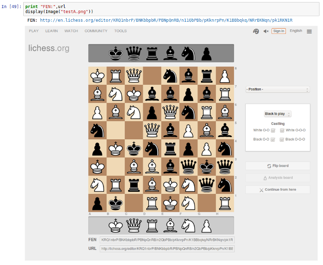
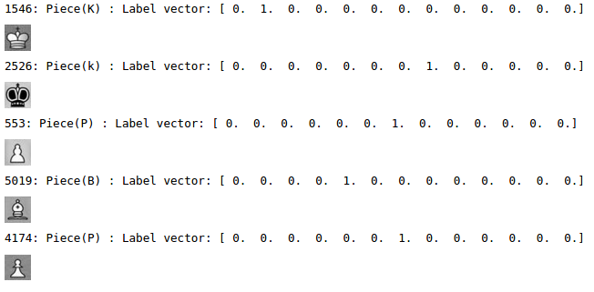
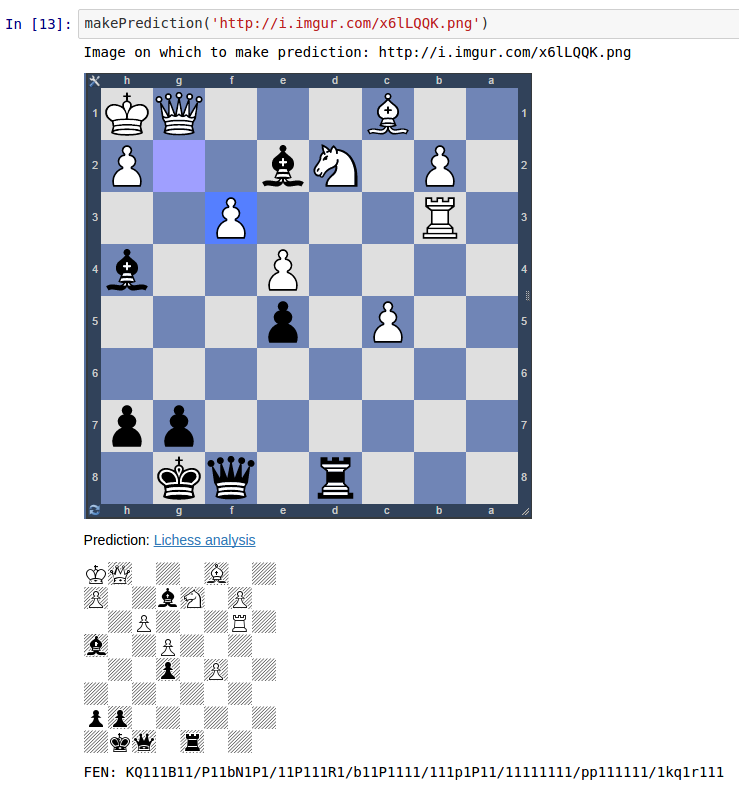

# Goal
Build a Reddit bot that listens on /r/chess and replies to posts with screenshots of chessboards with a link to the lichess.org analysis page and the FEN ([Forsyth-Edwards Notation](https://en.wikipedia.org/wiki/Forsyth%E2%80%93Edwards_Notation)) string of the board.

## Workflow

There are three ipython notebooks which show the workflow from turning a screenshot of a chessboard into a set of 32x32 grayscale tiles, to generating those tiles for training and testing, and then the actual training and learning of the neural network from those trials using [TensorFlow](tensorflow.org).

1. [tensorflow_chessbot.ipynb](tensorflow_chessbot.ipynb) - Computer Vision
1. [tensorflow_generate_training_data.ipynb](tensorflow_generate_training_data.ipynb) - Generating a dataset from set of screenshots of chessboards in known configurations
1. [tensorflow_learn.ipynb](tensorflow_learn.ipynb) - **TensorFlow Neural Network Training & Prediction** (tensorflow_learn.ipynb)[tensorflow_learn.ipynb]

### #1 [tensorflow_chessbot.ipynb](tensorflow_chessbot.ipynb) - Computer Vision

Here is a screenshot with the detected lines of the chessboard overlaid, showing where we'll cut the image into tiles.

### #2 [tensorflow_generate_training_data.ipynb](tensorflow_generate_training_data.ipynb) - Generating a dataset

[Lichess.org](lichess.org) provides a URL interface with a FEN string that loads a webpage with that board arrayed. A nice repo called [pythonwebkit2png](https://github.com/adamn/python-webkit2png) provides a way to render webpages programmatically, allowing us to generate several (80 in thise) random FEN strings, load the URL and take a screenshot all automatically.

Here is 5 example tiles and their associated label, a 13 length one-hot vector corresponding to 6 white pieces, 6 black pieces, and 1 empty space.

### #3 [tensorflow_learn.ipynb](tensorflow_learn.ipynb) - **TensorFlow Neural Network Training & Prediction**

We train the neural network on generated data from 80 lichess.org screenshots, which is 5120 tiles. We test it with 5 screenshots (320 tiles) as a quick sanity check. Here is a visualization of the weights for the white King, Queen and Rook.

![Some weights][readme_images/weight_KQR.png]

Finally we can make predictions on images passed by URL, the ones from lichess and visually similar boards work well, the ones that are too different from what we trained for don't work, suggesting that getting more data is in order. Here is a prediction on the image for [this reddit post](https://www.reddit.com/r/chess/comments/45inab/moderate_black_to_play_and_win/)

### Ideation
Reddit post has an image link (perhaps as well as a statement "white/black to play").

Bot takes the image, uses some CV to find a chessboard on it, splits up into
a set of images of squares. These are the inputs to the tensorflow CNN
which will return probability of which piece is on it (or empty)

Dataset will include chessboard squares from chess.com, lichess
Different styles of each, all the pieces

Generate synthetic data via added noise:
 * change in coloration
 * highlighting
 * occlusion from lines etc.

Take most probable set from TF response, use that to generate a FEN of the
board, and bot comments on thread with FEN and link to lichess analysis